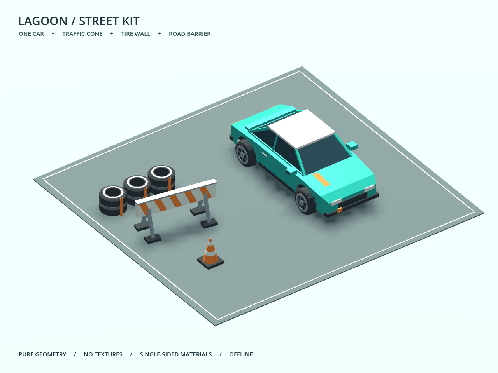

# V2 微缩街车与路边道具（独立候选）

2026-10-03。基准 `0da5395ba0e0858385c9c9a8c432807756771a6c`，分支 `codex/racing-models`。仅供主线统一验收；没有接入宿主、SDK、现用赛车原型或试玩包，没有合并/推送 main。目录中的 `.gdignore` 防止 RoomKit 主工程自动导入。



**图像范围：** 上图及 previews/ 是第二轮真实渲染，车辆 GLB 哈希为 `85e7f509…b2b1f9`。后续只读审查发现前轮转向穿入内部底盘，最终资产将中央底盘宽度从 1.22 米缩为 0.98 米，并拆为 Chassis_Visual 节点。外壳与四轮网格未改、面数/外包围盒未变；最终车模哈希为 `6ef93e4a…ca8bc9`。最终 GLB 已另做真实冷导入与轮转净空检查，**为遵守两轮渲染上限，没有对这次内部几何修正再截图；不能将旧图称为最终哈希的逐像素验收**。

## 资产与实测预算

Python 3.14.0 标准库从几何参数生成，未安装依赖、未调用网络服务、未使用外部纹理或品牌资源。造型是本轮独立制作的短尾两厢街车；文件沿用仓库 MIT 许可。V1 完整保留，不对其文件进行修复或覆盖。PATH、C:/Program Files 与 D:/Program Files 的常见 Blender 目录未发现 Blender；**没有 .blend 文件或 Blender 编辑/导出验收**。

| 文件（models/） | 三角面 | 材质 | 尺寸 X×Y×Z（米） | 退化面 |
|---|---:|---:|---|---:|
| street_car_v2.glb | 2,846 | 6 | 2.025 × 1.3655 × 4.1015 | 0 |
| traffic_cone_v2.glb | 176 | 3 | 0.470 × 0.689 × 0.470 | 0 |
| tire_barrier_v2.glb | 1,956 | 3 | 2.120 × 0.530 × 0.690 | 0 |
| road_barrier_v2.glb | 140 | 4 | 2.130 × 1.0275 × 0.790 | 0 |

整车含车体及四个轮网格，共 2,846 面，低于 5,000 面。一车加各一道具共 5,118 面；预览地台和标线另为 72 面，总计 5,190 面。全套资产共六种材质名，四个 GLB 各自内嵌所需材质（分别导入时不是跨文件共享的同一个 Godot Material 资源）。无 image、texture、外部 buffer URI、skin、动画片段和 required extension；全部材质单面，不用双面显示掩盖绕序。

轮胎护栏由三组各两只空心轮胎构成，是四件资产中最复杂的道具。当前没有 LOD；大规模赛道实例数量与目标设备性能仍需场景级验收。

## 坐标、轮轴与接入

- 一单位一米，`+Y` 向上，车头 `-Z`，驾驶员左侧 `-X`。根节点在地面上，根旋转/缩放为单位变换；各道具同样以地面为 Y=0。
- V1 的车头是 `+X`，左侧是 `-Z`。若主线以后显示 V1 对比，显式用 `(x_new,y_new,z_new)=(z_old,y_old,-x_old)`（绕 +Y 90°）；**V2 已直接生成目标坐标，不再加这个旋转**。
- 轴距 2.45 米、轮距 1.64 米、滚动半径 0.34 米。四轮各有独立 mesh/node；轮网格局部包围盒以原点对称，轴沿 X。

```text
Street_Car_V2
├─ Body
├─ Chassis_Visual    # 内部窄底盘，不作为自动物理碰撞
├─ Steer_Front_Left  (-0.82, 0.34, -1.23)
│  └─ Wheel_Front_Left
├─ Steer_Front_Right (+0.82, 0.34, -1.23)
│  └─ Wheel_Front_Right
├─ Steer_Rear_Left   (-0.82, 0.34, +1.22)
│  └─ Wheel_Rear_Left
├─ Steer_Rear_Right  (+0.82, 0.34, +1.22)
│  └─ Wheel_Rear_Right
└─ CenterOfMass_Suggested (0, 0.52, 0.04)
```

在目标 Godot 工程内复制所需 `models/*.glb` 到可导入目录，等待导入，再实例化 PackedScene。保留上述命名；可通过 `find_child("Steer_Front_Left", true, false)` 定位，避免依赖导入器额外根节点。只旋转转向父节点和轮子子节点，不旋转 Body 或整个模型来冒充轮转。

```gdscript
# speed 是沿车头方向为正的米/秒，steering 是弧度；纯展示接线。
roll_angle -= speed / 0.34 * delta
for suffix in ["Front_Left", "Front_Right", "Rear_Left", "Rear_Right"]:
    var hub = car.find_child("Steer_" + suffix, true, false)
    var mesh = car.find_child("Wheel_" + suffix, true, false)
    hub.rotation.y = steering if suffix.begins_with("Front") else 0.0
    mesh.rotation.x = roll_angle
```

正 Y 转向使 `-Z` 车头朝 `-X`（左）偏转。实际短验前轮约 +25.19°，四轮绕 X 转动约 -4.03 弧度；后轮转向保持 0，轮心变化小于 0.00001 米。这里没有 Ackermann、悬挂或接地物理。若加悬挂，移动 Steer 节点的局部 Y，并保留轮子局部原点为零。

## 重心与碰撞建议（尚未物理验收）

`CenterOfMass_Suggested` 是可见模型中的空标记，建议 RigidBody3D 使用自定义重心 `(0,0.52,0.04)`，不是计算出的真实质量分布。GLB 不包含物理体或自动碰撞命名后缀。

初次接入可用两只 BoxShape3D 作车体近似：底盘 `size=(1.42,0.58,3.70)`、中心 `(0,0.58,0)`；座舱 `size=(1.12,0.46,1.60)`、中心 `(0,1.10,0.15)`。忽略后视镜、把手和灯条；轮胎半径 0.34、可见胎宽约 0.26 米，轴向饰件总宽约 0.308 米。车轮接地交给所选车辆控制器处理，不把整个可见网格做移动物体的凹碰撞。

锥桶可用凸包或圆锥近似；轮胎护栏可用一只 `2.12×0.53×0.69` 的静态盒；路障可用横板盒加支架盒。碰撞弹性、质量、重心高度、最大转角下的遮挡/穿插以及悬挂行程必须在驾驶原型中调整，本次不宣称碰撞或驾驶通过。

## 一个本机预览入口

双击本目录 **Preview.cmd**。首次在新 checkout 会执行一次独立冷导入与截图；已存在验收结果时复用本地预览。按 `1` 看 3/4、`2` 看俯视、`3` 看道具套装，`Space` 切换轮转/转向，`Esc` 退出。它只显示美术，不启动 RoomKit 服务或连接网络。

本轮入口会优先使用通过 headless 净空检查的最终 GLB；交互按键本轮未做人工操作验收。已有截图结果的位置：

```text
F:\文档\GodotGame\Net\RoomKit\artifacts\worktrees\racing-models\artifacts\racing-models\review-02\
```

## 复生成与复验

在本工作树根执行（或把命令中的目录改为目标 checkout）：

```powershell
py -B prototypes/racing_visual/v2/generate_models.py
py -B prototypes/racing_visual/v2/validate_models.py
py -B prototypes/racing_visual/v2/run_preview.py --run-name review-01
```

`generate_models.py` 只重写本目录 models/ 与 source_manifest.json。`validate_models.py` 独立解析实际 GLB 字节，验证容器/buffer/view/accessor 边界、索引、有限值、单位法线与绕序一致、三角形面积、包围盒、命名/独立轮轴与预算，写 validation.json；退化判据沿用 V1 的 `cross_squared < 1e-16`。它是针对本生成格式的校验器，不是完整 Khronos Validator。

`run_preview.py` 仅使用固定已知引擎 `D:\SteamLibrary\steamapps\common\Godot Engine\godot.windows.opt.tools.64.exe`，逐字节哈希一致副本放在当前工作树 `artifacts/racing-models/runtime/`，旁置 `._sc_`；不借用共享 editor_data。独立 project、profile、TEMP、HOME、APPDATA、XDG 目录与日志均位于本工作树 artifacts。引擎副本约 173 MiB，可供两轮共用；没有安装或导出模板复制。

每次验收用不存在的 run-name，拒绝复用旧 `.godot`。默认最多保留两轮；第三轮前需按项目规则核实证据、进程和引用后处理旧生成目录，脚本不自动删除。`--interactive --run-name review-02` 打开已有预览（本轮优先 final-import 最终车模），不重做冷导入。截屏来自真实 Viewport，不是 Python 模拟或图像生成器。

最后的净空补验命令是 `py -B prototypes/racing_visual/v2/verify_final_import.py`（依赖本轮 review-02 的隔离运行时；为保留原证据，已有 final-import 时拒绝覆盖）。这次使用另一个全新缓存，只有 headless 导入与网格运算，不执行第三轮渲染。尝试按最近两份规则移除 review-01/project 时，自动审批审查拒绝整条命令，仅返回 `blocked by policy`；未执行清理或换工具重试。因此当前暂留三个小型生成工程（两轮截图工程加最终 headless 工程），共享一个引擎副本；首轮证据完整保留，清理未完成。

## 本轮结果与限制

| 门禁/真实命令 | 结果 |
|---|---|
| `git --version` | 2.55.0.windows.3，退出 0 |
| 已知 Godot `--version` 与隔离副本 `--version` | `4.7.2.stable.steam.ed1daf0bf`，退出 0 |
| `py -B .../generate_models.py` | 退出 0，四份 GLB；最终 SHA256 见 source_manifest.json |
| `py -B .../validate_models.py` | 退出 0，四份 PASS，0 退化面 |
| `py -B .../run_preview.py --run-name review-01` | 驱动退出 0；首次 cold-import 0、render 0；结构/动态通过；人工视觉因过曝未接受 |
| `py -B .../run_preview.py --run-name review-02` | 驱动退出 0；全新工程 cold-import 0、render 0；最终四张 PNG 已逐张亲自查看 |
| 两轮引擎 stderr、错误扫描 | stderr 均为空，无 SCRIPT ERROR / Parse Error / ERROR |
| 四轮短验 | 单轮转动不改变另外三轮；60 个真实渲染帧中四轮滚动、前轮转向、后轮不转向；轮心保持；两轮均通过 |
| 首次净空只读审查 | 失败：约 25° 转向时两个前轮侵入原 1.22 米中央底盘；当时的轮心检查未覆盖此项 |
| `py -B .../verify_final_import.py` | 驱动、全新 cold-import、final-mesh-check 均退出 0；最终 GLB 60 组左右轮姿态通过，保守扫掠净空大于 4 厘米；只覆盖 Chassis_Visual，不声称全车碰撞通过 |

渲染设备 `NVIDIA GeForce RTX 3080`，OpenGL 3.3 / Compatibility。`previews/` 收录第二轮原始 1280×960 截图，未后期调色；它们在内部底盘修正之前，范围见本文开头。`evidence.json` 收录两轮真实命令、退出码、运行结果与来源哈希，以及最终 headless 检查；完整原始日志保留在各 run 的 evidence/，并交到主项目 `artifacts/racing-models-candidate/evidence/`。第一轮过曝截图留在 review-01，不能用第二轮结果掩盖视觉缺陷。

第二轮实看：车身、车窗、四轮和前后朝向可分辨，灰色台面与模型对比足够；套装中锥桶、空心轮胎墙和条纹路障均可见。白顶与车身有明确分区；这是可看候选，最终风格仍由主线/用户评审。

Sol 只读复审定位了 V1 16 个精确零面积面对应前格栅倒角区域（未 Blender 复现），确认应独立检查 GLB 而不沿用 V1 原 PASS；新 V2 无此几何。没有使用素材生成技能：本任务需要可进入 Godot 的 3D 网格及轮轴，直接程序化建模更合适。

未运行：最终底盘修正后的再次截图、Blender/.blend、Linux/Web/手机、完整 glTF Validator、Godot 独立 EXE/PCK 导出、物理/悬挂/驾驶/联网、长期性能、主线接入与正式包更新。交付者没有推送 main；根 README/STATUS/ROADMAP/docs17 由主线维护。
